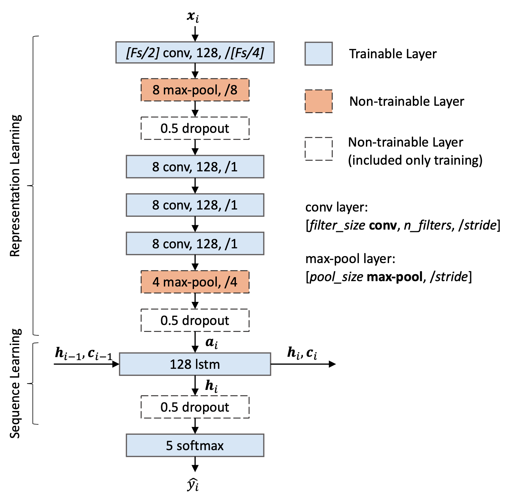
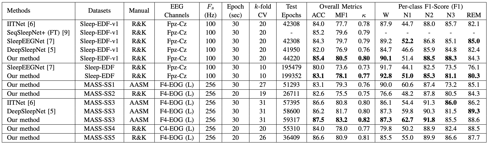

# TinySleepNet

An efficient deep learning model for sleep stage scoring based on raw, single-channel EEG. This work is an extension of our previous work, DeepSleepNet [[paper](http://ieeexplore.ieee.org/document/7961240/)][[github](https://github.com/akaraspt/deepsleepnet)].

Code for the model in the paper *TinySleepNet: An Efficient Deep Learning Model for Sleep Stage Scoring based on Raw Single-Channel EEG by Akara Supratak and Yike Guo from The Faculty of ICT, Mahidol University and Imperial College London respectively*.

This work has been accepted for publication in [2020 42nd Annual International Conference of the IEEE Engineering in Medicine & Biology Society (EMBC)](https://ieeexplore.ieee.org/document/9176741).

## Model Architecture

Note: Fs is the sampling rate of the input EEG signals

## Performance Comparison

Note: ACC = accuracy, MF1 = Macro F1-Score


## Environment

* CUDA 10.0
* cuDNN 7
* Tensorflow 1.13.1

## Create a virtual environment with conda

```bash
conda create -n tinysleepnet python=3.6
conda activate tinysleepnet
pip install -r requirements.txt
```

## How to run

1. `python download_sleepedf.py`
1. `python prepare_sleepedf.py`
1. `python trainer.py --db sleepedf --gpu 0 --from_fold 0 --to_fold 19`
1. `python predict.py --config_file config/sleepedf.py --model_dir out_sleepedf/train --output_dir out_sleepedf/predict --log_file out_sleepedf/predict.log --use-best`

## Citation
If you find this useful, please cite our work as follows:

    @INPROCEEDINGS{Supratak2020,
        title = {TinySleepNet: An Efficient Deep Learning Model for Sleep Stage Scoring based on Raw Single-Channel EEG},
        author = {Supratak, Akara and Guo, Yike},
        booktitle = {2020 42nd Annual International Conference of the IEEE Engineering in Medicine Biology Society (EMBC),
        year = {2020},
        volume = {}, 
        number = {}, 
        pages = {641-644}, 
        doi = {10.1109/EMBC44109.2020.9176741}, 
        ISSN = {}, 
    }

## Licence
- For academic and non-commercial use only
- Apache License 2.0
